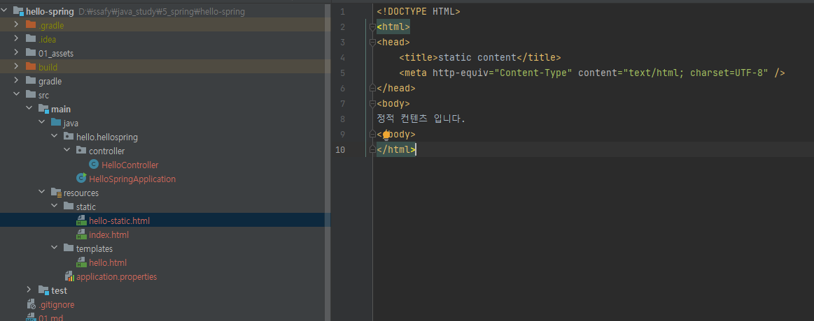
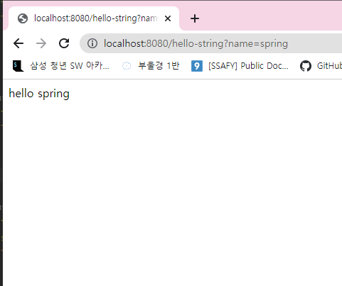

### 환경설정

### 라이브러리

- 라이브러리가 굉장히 많이 깔려있다

- 스프링 스타터를 하면 기본적으로 다 라이브러리를 임포트한다

라이브러리 2개만 깔았지만 수많은 라이브러리가 깔려서 나옴

### view 설정

templates의 hello를 찾아서 실행

### 정적 컨텐츠

- 파일을 그대로 내린다

### MVC와 템플릿 엔진

- MVC: Model, View, Controller

- 파일을 렌더링한 html 을 내려준다

- 에러

- 쿼리로 보내기

### API

- 데이터 바로 내리기

- @ResponseBody 를 사용하면 뷰 리졸버( viewResolver )를 사용하지 않음
  대신에 HTTP의 BODY에 문자 내용을 직접 반환(HTML BODY TAG를 말하는 것이 아님)

- 객체를 내린다

@ResponseBody 를 사용하고, 객체를 반환하면 객체가 JSON으로 변환됨

